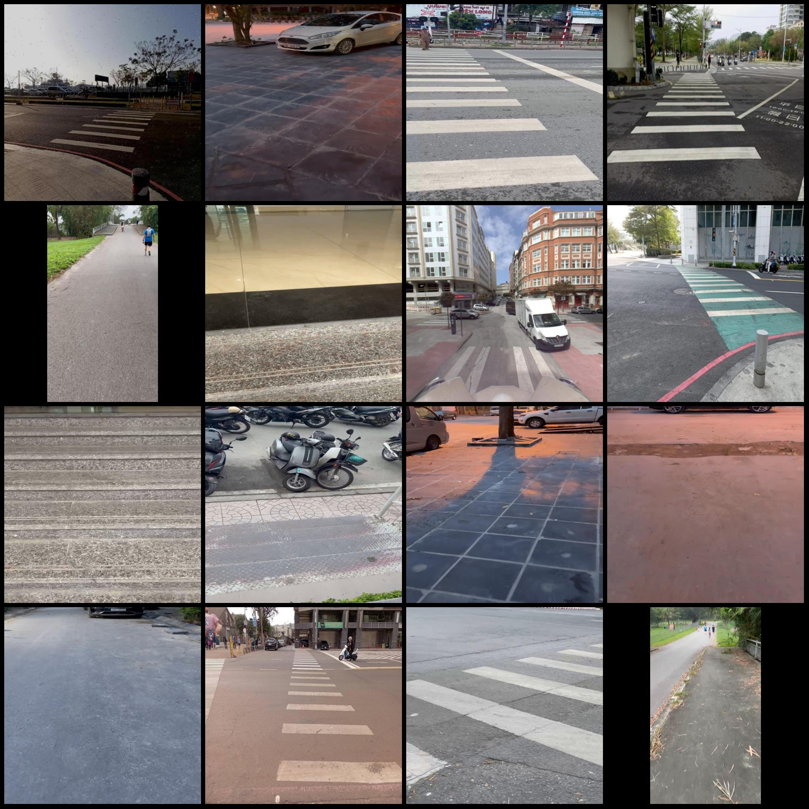
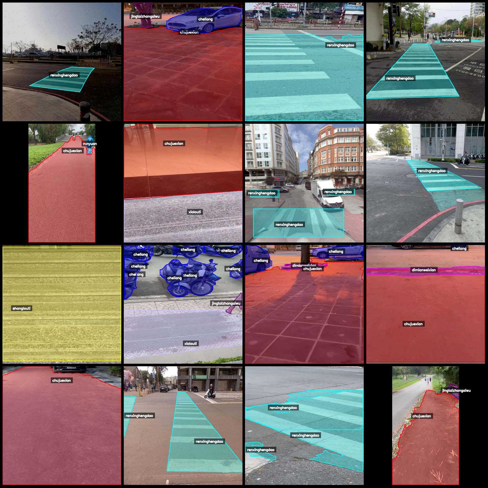
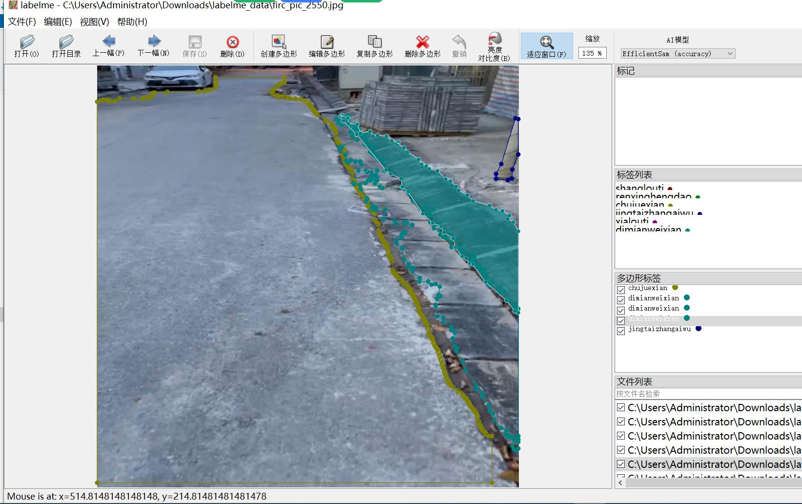

# Blind Person Road Traffic Intersection Assistance Analysis and Segmentation Data Set: 4184 Images in LabelME Format (8 Categories)

Dataset format: LabelME format (excluding mask files, only containing JPG images and corresponding JSON files).
Number of images (JPG file count): 4184
Number of annotations (JSON file count): 4184
Number of categories: 8
Annotation categories: ["Cheliang", "Chujuexian", "Dimianweixian", "Jingtai zhangaiwu", "Renxinghengdao", "Renyuan", "Shanglouti", "Xialouti"]
Corresponding Chinese category names: ["Vehicle", "Touch Line", "Ground Hazard", "Static Obstacle", "Pedestrian Crossing", "Personnel", "Upstairs", "Downstairs"]
Number of boxes for each category:
Cheliang count = 1476
Chujuexian count = 2843
Dimianweixian count = 748
Jingtai zhangaiwu count = 2357
Renxinghengdao count = 1687
Renyuan count = 596
Shanglouti count = 162
Xialouti count = 241
Total box count: 10110
Annotation tool used: labelme=5.5.0
Image resolution: 640x640
Annotation rules: Polygons are drawn around the categories.
Important note: This dataset can be edited using LabelME, but the JSON dataset needs to be converted into either mask or yolo/coco format for semantic segmentation or instance segmentation.
Special declaration: This dataset does not guarantee any accuracy in the trained models or weight files.
Image preview:
Annotation example:
Annotation drawing results:
LabelME editing image example:

## Images

Here is a pay link on Stripe ( https://buy.stripe.com/3cs8yP7sY87d0vu9AB ). Please contact me lonlonago@foxmail.com after funding $89, and I will send you a complete data files , thank you!

